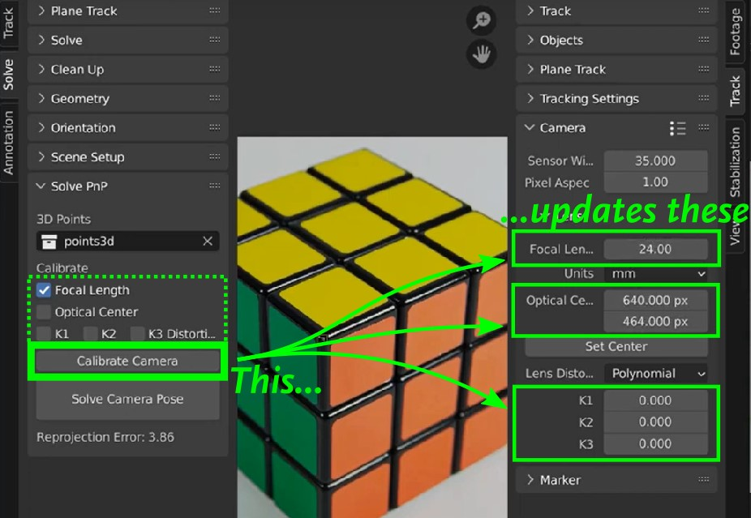

# Quick Start Guide
### What is Camera PnPoint?
An add-on for Blender that allows matching camera perspectives with reference images by using a Perspective-n-Point approach. It is able to adjust camera intrinsics, meaning lens parameters such as Focal Length, as well as extrinsics, namely the camera position and orientation in space.
The intrinsics module is the Calibrate operator, while the extrinsics module is the Pose solver. Both are inherently independent, but the Pose solver always assumes the camera intrinsics are correct. 

So you can chose to use the add-on for different purposes:
- To calibrate a camera with unknown parameters, such as lens distortion coefficients. You would normally use dedicated pictures of well-defined calibration patterns, such as a checker grid, for this purpose.
- To find a point of view of a calibrated camera to match a reference picture. You would input the lens parameters manually before solving the camera pose in this case.
- To find a point of view of an uncalibrated camera with unknown parameters. In this case you would need to perform a calibration first and then solve the camera pose.

### How do I get started?
To be able to match a perspective with Camera PnPoint you need fundamentally two things: 
- a reference image (of course!) and 
- the coordinates of a few points in 3D space visible in the image. 

You will need at least 4 points for a camera pose solve and at least 6 points for a camera calibration, but more points may be prefered for a higher quality fit. See the section on Camera Calibration further below for some guidance.
The reference image is loaded as a movie clip in the Clip Editor. This will allow the definition of properties for the image such as the camera parameters, as well as the 2D point list.
The 3D features will be defined in the 3D editor. You can use helpers for that such as manually created dummy geometry, or other references such as CAD data imported from external sources. Of course you can also chose not to use any reference geometry if you already know the coordinates of the points.

### How do I add 3D points to the scene?
the 3D points are defined by the location of objects found in a dedicated collection. Any object can be used for this purpose, for example empty objects. Just make sure they are all stored in isolation in a dedicated collection.

### How do I add 2D points to the image?
The 2D points are defined by the locations of tracks in the Clip. Track markers can be added with the add button or with Ctrl+left click on the image itself. 

### How does the Add-on know how to pair the 3D and 2D points?
The 2D points and 3D points are paired together based on the Track names and Object names in alphabetical order. There is no particular need to name them the same, they just need to be sorted equally. You can inspect the current names and their order in the Dope Sheet and the Outliner.
The easy way to not have to worry much about the pairing is to create the 2D markers and the 3D points in the same sequence. This way the default names will be alphabetically aligned by default, for example:
|Creation sequence|2D Marker Names|3D Point Names|
|-|-|-|
|1|Track|Empty|
|2|Track.001|Empty.001|
|3|Track.002|Empty.002|
|4|Track.003|Empty.003|
|5|Track.004|Empty.004|
|6|Track.005|Empty.005|

The final step to let the addon know which 3D objects are the 3D points is to point to the collection where they are stored in the add-on panel. 
>Note: if for any reason you would create more 2D points than 3D points, or the other way around, the calibration and Pose solvers will throw a warning but they will still try to find a match, ignoring the extra points at the bottom of the longest list.

### How do I Calibrate a camera?
The PnP solver always assumes the camera intrinsic parameters are well known and calibrated for the reference image. This involves the following parameters:
- Focal Length
- Optical Center (or Principal Point)
- Radial Distortion Coefficients K1, K2 and K3 (compatible with Polynomial and Brown distortion models)

Since these parameters are linked to the reference image, they are always stored in the Camera properties of the Clip. These properties can be found in the N panel of the Clip Editor, under Camera...
>**IMPORTANT:** The settings in the Clip's camera properties are considered "ground truth" by the PnP solver, and they are copied over to the actual camera in the 3D viewport when you perform a Pose solve. Always change the lens settings in the Clip's camera, not on the 3D camera, otherwise they will be overwritten by the Pose solver.

You can adjust the camera settings manually if you do have a calibrated camera with known parameters. Otherwise you can perform an automatic calibration based on the existing 2D-3D point pairs. 
To perform an automated calibration, you first need to select the parameters you want to tune with the check boxes. The parameters unchecked will be left unchanged. For more details and hints on how to use the calibration tool, see the section on Camera Calibration further below.

[[fig/CalibOp.jpg | width=400]]

### Ho do I solve a camera Pose?
The Solve Pose operator is in charge of finding the camera position and orientation to match the image view. It has different behaviours depending on the current user selection.

**The active object is a camera.** The operator understands the user wants to update this camera.

**The active object is NOT a camera.** The operator will create a new camera. Other cameras will be left unchanged.

In both cases the operator will perform the following tasks on the camera:
- It sets its position and orientation, of course.
- It updates its lens parameters (Focal Length, Optical Center, Radial Distortion) **to match the ones in the Clip's camera**
(remember those are always assumed correct. If they are not you should perform a calibration first).
- It sets the reference image as a camera background with lens undistortion enabled

> foto solve pose

# The Calibration module: Capabilities and Limitations
It's worth noting that camera intrinsics calibration is a complex calculation in the fully generalized form. This is because it's a multi-dimensional problem where some of the degrees of freedom can be strongly correlated. The way this problem is typically approached is by taking many pictures of the same calibration pattern from different angles, in order to reduce the level of undetermination and better constrain the solution.

When calibrating a camera with only one single image, it is advised to reduce the complexity of the problem by reducing the number of degrees-of-freedom, or in other words, by keeping some of the parameters fixed. It is usually the case we can make some assumptions on the characteristics of the lens. For example, radial distortion coefficients are close to zero for high focal lengths, and optical centers should be very close to the center of the image for uncropped pictures. The Focal length is probably the parameter with the highest sensitivity to the overall camera match, this is why it is enabled by default in the add-on.

The number and the position of the points also play a big role on the performance of the calibration. The following is a non-exhaustive summary to what to keep in mind when calibrating lens parameters, which hopefully provides a good starting point.

|Parameter|When It Matters|Best Point Locations|
|-|-|-|
|Focal Length|High sensitivity, important to calibrate if unknown|3D points placed at different distances to the camera, such as some in the foreground and some in the background|
|Optical Center|Not critical unless you suspect the image is cropped and it has a wide FoV|Points with 2D projections distributed around the edges of the image. More points is better|
|Radial Distotion|Important for high FoV images|Just as with optical center, points with 2D projections distributed around the edges of the image. More points is better|

